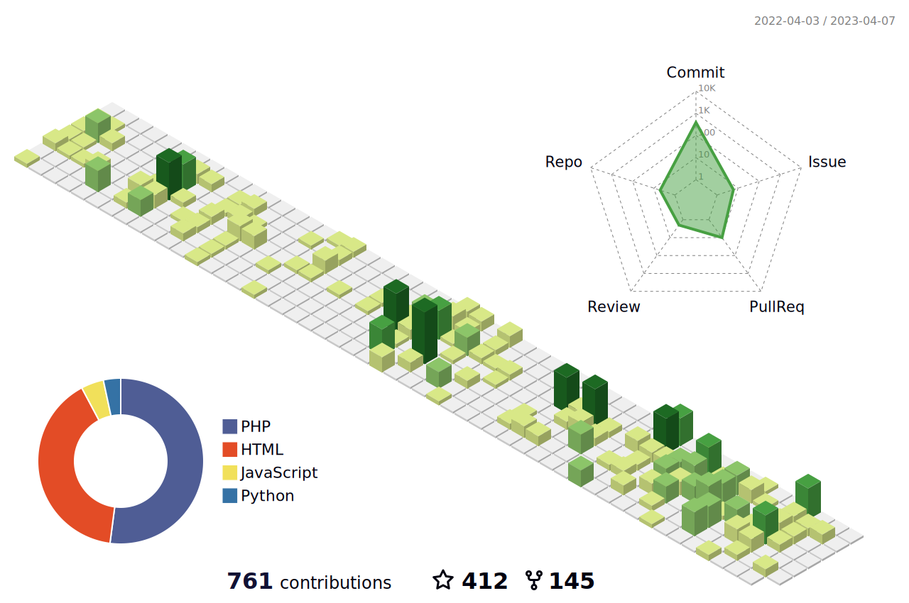

<!-- Actual text -->
You can find me on [![Twitter][1.2]][1], or on [![LinkedIn][2.2]][2].

<!-- Icons -->

[1.2]: http://i.imgur.com/wWzX9uB.png (twitter icon without padding)
[2.2]: https://raw.githubusercontent.com/MartinHeinz/MartinHeinz/master/linkedin-3-16.png (LinkedIn icon without padding)

<!-- Links to your social media accounts -->

[1]: https://twitter.com/soderlind
[2]: https://www.linkedin.com/in/soderlind/

## Resent activity

<table width="100%" border="0"><tr><td width="49%">

### On GitHub

<!--START_SECTION:activity-->
1. 🚀 Published release [1.0.12](https://github.com/dss-web/jobbnorge-block/releases/tag/1.0.12) in [dss-web/jobbnorge-block](https://github.com/dss-web/jobbnorge-block)
2. 🎉 Merged PR [#6](https://github.com/dss-web/jobbnorge-block/pull/6) in [dss-web/jobbnorge-block](https://github.com/dss-web/jobbnorge-block)
3. 🎉 Merged PR [#5](https://github.com/dss-web/jobbnorge-block/pull/5) in [dss-web/jobbnorge-block](https://github.com/dss-web/jobbnorge-block)
4. 🎉 Merged PR [#4](https://github.com/dss-web/jobbnorge-block/pull/4) in [dss-web/jobbnorge-block](https://github.com/dss-web/jobbnorge-block)
5. 🎉 Merged PR [#3](https://github.com/dss-web/jobbnorge-block/pull/3) in [dss-web/jobbnorge-block](https://github.com/dss-web/jobbnorge-block)
<!--END_SECTION:activity-->
  </td>
<td width="49%" valign="top">
  
</td></tr></table>

