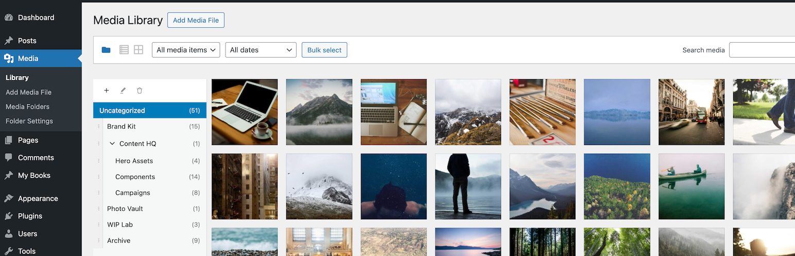
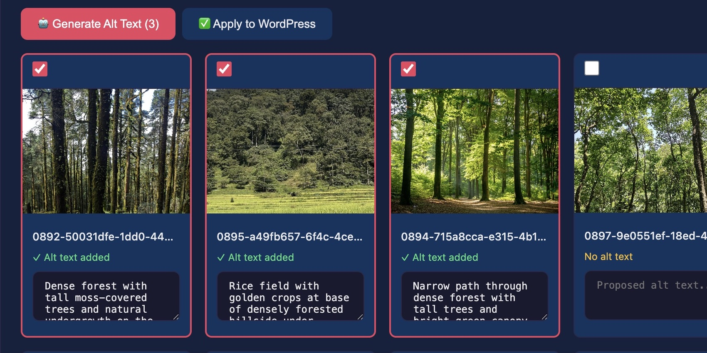

<!--  -->

## WordPress Plugins

Repos below are my WordPress plugins hosted here at GitHub. Easy to install. [Plugin updates are handled automatically](https://github.com/soderlind/wordpress-plugin-github-updater?tab=readme-ov-file#wordpress-plugin-github-updater) via GitHub. No need to manually download and install updates.

<!-- plugins starts -->

<table>
<tr>
<td colspan="2">

### Virtual Media Folders

Virtual Media Folders brings folder organization to your WordPress Media Library. Organize your media files into hierarchical folders <strong>without moving files on disk</strong>. Folders are virtual, so your URLs never change.

</td>
</tr>
<tr>
<td valign="top" width="50%">

**<a href="https://github.com/soderlind/virtual-media-folders#readme">Virtual Media Folders</a>** ⭐ 16

Also available on <a href="https://wordpress.org/plugins/virtual-media-folders/" target="_blank">WordPress.org</a>.

</td>
<td valign="top" width="50%">

**<a href="https://github.com/soderlind/vmfa#readme">Virtual Media Folders - Add-On Manager</a>** ⭐ 3

🚀 <b>Install and manage add-ons that extend Virtual Media Folders.</b>

</td>
</tr>
<tr>
<td valign="top" width="50%">

**<a href="https://github.com/soderlind/vmfa-ai-organizer#readme">Virtual Media Folders - AI Organizer</a>** ⭐ 4

Uses vision-capable AI models to analyze actual image content and automatically organize your media library into virtual folders. This is add-on functionality requiring an API key from a supported AI service provider, or a local LLM.

</td>
<td valign="top" width="50%">

**<a href="https://github.com/soderlind/vmfa-editorial-workflow#readme">Virtual Media Folders - Editorial Workflow</a>** ⭐ 1

Role-based folder access, move restrictions, and Inbox workflow for Virtual Media Folders.

</td>
</tr>
<tr>
<td valign="top" width="50%">

**<a href="https://github.com/soderlind/vmfa-folder-exporter#readme">Virtual Media Folders - Folder Exporter</a>** ⭐ 1

Export folders (or subtrees) as ZIP archives with optional CSV manifests.

</td>
<td valign="top" width="50%">

**<a href="https://github.com/soderlind/vmfa-media-cleanup#readme">Virtual Media Folders - Media Cleanup</a>** ⭐ 2

Tools to identify and clean up unused or duplicate media files.

</td>
</tr>
<tr>
<td valign="top" width="50%">

**<a href="https://github.com/soderlind/vmfa-migrate#readme">Virtual Media Folders - Migrate</a>**

Migration add-on for Virtual Media Folders. Import folders and file assignments from other media folder plugins.

</td>
<td valign="top" width="50%">

**<a href="https://github.com/soderlind/vmfa-rules-engine#readme">Virtual Media Folders - Rules Engine</a>** ⭐ 1

Rule-based automatic folder assignment for media uploads, based on metadata, file type, or other criteria. 

</td>
</tr>
<tr>
<td colspan="2">

### :robot: AI Experiments :robot:

Some are in early beta, while others are production ready, and all explore how AI can be used in WordPress.

</td>
</tr>
<tr>
<td valign="top" width="50%">

**<a href="https://github.com/soderlind/admin-coach-tours#readme">Admin Coach Tours</a>** ⭐ 3

AI-powered interactive tutorials for the WordPress block editor.

</td>
<td valign="top" width="50%">

**<a href="https://github.com/soderlind/ai-alt-text#readme">AI Alt Text</a>** ⭐ 1

Generate alt text for images using AI. Supports multiple AI providers including OpenAI, Claude, Gemini, Ollama, Azure OpenAI, and Grok.

</td>
</tr>
<tr>
<td valign="top" width="50%">

**<a href="https://github.com/soderlind/ai-provider-for-azure-openai#readme">AI Provider for Azure OpenAI</a>** ⭐ 3

This plugin provides Azure OpenAI integration for the WordPress AI Client, enabling text generation, image generation, embedding generation, and text-to-speech using Azure's hosted OpenAI models.

</td>
<td valign="top" width="50%">

**<a href="https://github.com/soderlind/ai-router#readme">AI Router</a>** ⭐ 5

Route AI requests to different provider configurations based on capability. Configure multiple instances of the same AI provider (e.g., GPT-4o for text, gpt-image-1 for images) and let AI Router automatically select the right one.

</td>
</tr>
<tr>
<td valign="top" width="50%">

**<a href="https://github.com/soderlind/ai-valve#readme">AI Valve</a>** ⭐ 14

Control, meter, and permission-gate AI usage from plugins that connect through the WordPress 7 AI connector.

</td>
<td valign="top" width="50%">

**<a href="https://github.com/soderlind/azure-ai-foundry#readme">Azure AI Foundry</a>** ⭐ 1

Connect WordPress 7.0+ to Azure AI Foundry for text generation, image generation, embeddings, and more.

</td>
</tr>
<tr>
<td valign="top" width="50%">

**<a href="https://github.com/soderlind/content-poll#readme">Content Poll</a>** ⭐ 2

A modern, accessible polling block that lets visitors vote on questions about your content. Generate the poll using AI. Supports multiple AI providers including OpenAI, Claude, Gemini, Ollama, Azure OpenAI, and Grok.

</td>
<td valign="top" width="50%">

**<a href="https://github.com/soderlind/ps-design-system#readme">PS Design System</a>**

Extract design systems from WordPress themes using deterministic parsing and AI synthesis.

</td>
</tr>
<tr>
<td valign="top" width="50%">

**<a href="https://github.com/soderlind/talking-head#readme">Talking Head</a>** ⭐ 1

Talking Head lets you write multi-speaker conversations in the WordPress block editor, then generate podcast-quality audio using AI text-to-speech. Each speaker ("head") gets their own voice, and the plugin stitches the segments together into a single audio file with configurable silence gaps.

</td>
<td valign="top" width="50%"></td>
</tr>
<tr>
<td colspan="2">

### WordPress Multisite Plugins

</td>
</tr>
<tr>
<td valign="top" width="50%">

**<a href="https://github.com/soderlind/all-sites-cron#readme">All Sites Cron</a>** ⭐ 7

Run wp-cron on all public sites in a multisite network

</td>
<td valign="top" width="50%">

**<a href="https://github.com/soderlind/multisite-exporter#readme">Multisite Exporter</a>** ⭐ 6

Multisite Exporter is a WordPress plugin that allows you to export content from all subsites in a WordPress multisite installation. The plugin generates WordPress XML (WXR) files by running the WordPress exporter on each subsite in the background using the Action Scheduler library, making it efficient even for large multisite networks.

</td>
</tr>
<tr>
<td valign="top" width="50%">

**<a href="https://github.com/soderlind/super-admin-all-sites-menu#readme">Super Admin All Sites Menu</a>** ⭐ 33

For the super admin, replace WP Admin Bar My Sites menu with an All Sites menu.

Also available on <a href="https://wordpress.org/plugins/super-admin-all-sites-menu/" target="_blank">WordPress.org</a>.

</td>
<td valign="top" width="50%">

**<a href="https://github.com/soderlind/super-admin-switch-to-admin#readme">Super Admin Switch To Admin</a>** ⭐ 7

If you are logged in as a super admin, this User Switching companion allows you to switch to a regular admin account on the current site.

</td>
</tr>
<tr>
<td colspan="2">

### Miscellaneous WordPress Plugins

</td>
</tr>
<tr>
<td valign="top" width="50%">

**<a href="https://github.com/soderlind/additional-javascript#readme">Additional Javascript</a>** ⭐ 4

Use WordPress Customizer to add JavaScript

</td>
<td valign="top" width="50%">

**<a href="https://github.com/soderlind/cm-beautiful#readme">Color Me Beautiful</a>** ⭐ 1

Personalise the WordPress admin with your own accent colour.

</td>
</tr>
<tr>
<td valign="top" width="50%">

**<a href="https://github.com/soderlind/custom-document-folder#readme">Custom Document Folder</a>** ⭐ 3

Organize document uploads by automatically directing specific file types to custom folders based on their extensions.

</td>
<td valign="top" width="50%">

**<a href="https://github.com/soderlind/editor-can-manage-privacy-options#readme">Editor Can Manage Privacy Options</a>** ⭐ 1

A lightweight WordPress plugin that grants the Editor role access to manage site Privacy Settings — capabilities normally restricted to Administrators.

</td>
</tr>
<tr>
<td valign="top" width="50%">

**<a href="https://github.com/soderlind/gf-html-area-editor#readme">Gravity Forms HTML Area Editor</a>** ⭐ 2

Adds a rich text editor (TinyMCE) to the Gravity Forms HTML field content setting, replacing the default plain textarea.

</td>
<td valign="top" width="50%">

**<a href="https://github.com/soderlind/passwp-posts#readme">PassWP - Posts</a>** ⭐ 1

A simple password protection plugin for WordPress—no usernames, no accounts, just one shared password. Share the password with those who need access and they're in. Perfect for situations where you need quick, hassle-free access control without user management.

</td>
</tr>
<tr>
<td valign="top" width="50%">

**<a href="https://github.com/soderlind/read-offline#readme">Read Offline</a>** ⭐ 33

Read Offline allows you to download posts and pages. You can download the post as PDF, ePub and markdown

</td>
<td valign="top" width="50%">

**<a href="https://github.com/soderlind/redis-queue#readme">Redis Queue</a>** ⭐ 1

Robust Redis-backed background job processing for WordPress. Provides prioritized, delayed, and retryable jobs with an admin UI, REST API, token-based auth (scopes + rate limiting), and extensibility for custom job types.

</td>
</tr>
<tr>
<td valign="top" width="50%">

**<a href="https://github.com/soderlind/wp-loupe#readme">WP Loupe</a>** ⭐ 84

WP Loupe is a powerful search enhancement plugin for WordPress that delivers fast, accurate, and typo-tolerant search results. WP Loupe exposes a developer-friendly API so you can build your own search UI. WP Loupe works out of the box with WordPress’s standard search.

</td>
<td valign="top" width="50%">

**<a href="https://github.com/soderlind/wp-loupe-admin-search#readme">WP Loupe - Admin Search Add-On</a>** ⭐ 2

A faster, smarter search experience for the WordPress admin. This add-on replaces the default admin search with WP Loupe-powered typo-tolerant, relevance-ranked results.

</td>
</tr>
</table>

<!-- plugins ends -->

## WordPress & GitHub Copilot

I made the [WordPress Development — Copilot Instructions](https://github.com/github/awesome-copilot/blob/main/instructions/wordpress.instructions.md) (please improve them) at [Awesome GitHub Copilot Customizations](https://github.com/github/awesome-copilot). You can install them by clicking:     

**Spec-Driven WordPress Development**, clearly stated. Everything flows from the [**Constitution**](https://github.com/soderlind/wordpress-sdd).

<table border="0">
<tr><td xvalign="top" width="20%" ></a></td>
  <td valign="top">
    <dl>
      <dt><a href="https://github.com/soderlind/prepare-wordpress">prepare-wordpress</a></dt>
      <dd>An agent skill that scaffolds (or updates) a WordPress project with dev tooling, coding standards, testing, git hooks, and i18n support.</dd>
      <dt><a href="https://github.com/soderlind/wp-cli-local">wp-cli-local</a></dt>
      <dd>An AI agent skill that runs WP-CLI commands against Local (by Flywheel) sites on macOS.</dd>
	  <dd><ul>
	  <li>"List all plugins on my Local site"</li>
	  <li>"Activate the woocommerce plugin"</li>
	  <li>"What version of WordPress is running?"</li>
	  <li>"Export wp_options"</li>
	  </ul></dd>
    </dl>  
  </td></tr>
<tr><td xvalign="top" width="20%" ></a></td>
  <td valign="top">
    <dl>
	  <dt><a href="https://github.com/soderlind/vs-local-wp">LocalWP Assistant — VS Code Chat Participant</a></dt>
      <dd>A GitHub Copilot Chat participant (@localwp) that lets you query and manage your Local by Flywheel WordPress sites directly from VS Code.
	  
Also available on the <a href="https://marketplace.visualstudio.com/items?itemName=persoderlind.localwp-assistant">VS Code Marketplace</a>

	  </dd>
      <dt><a href="https://github.com/soderlind/wordpress-readme-preview">WordPress Readme</a></dt>
      <dd>A Visual Studio Code extension that provides syntax highlighting, IntelliSense, live preview and validation for WordPress plugin readme.txt files with pixel-perfect WordPress.org rendering and comprehensive compliance checking.
	  
Also available on the <a href="https://marketplace.visualstudio.com/items?itemName=persoderlind.wordpress-readme-preview">VS Code Marketplace</a>

    </dl>  
  </td></tr>
<tr><td xvalign="top" width="20%" ></td>
  <td valign="top">
    <dl>
      <dt><a href="https://github.com/soderlind/ralph-wp">Ralph  for WordPress projects</a></dt>
      <dd>A tiny runner around GitHub Copilot CLI that loops in small, clean iterations—1 feature per run + commit, progress log, and a PRD checklist.</dd>
      <dt><a href="https://github.com/soderlind/ralph-wp-testing">Ralph WP Testing</a></dt>
      <dd>Shows how to build an end-to-end WordPress plugin testing setup with complete PHPUnit coverage, built for automated runs with Ralph.</dd>
    </dl>  
  </td></tr>
  <tr>
  <td width="20%"></td>
  <td valign="top">
	<dl>
	  <dt><a href="https://github.com/soderlind/wp-fotokopilot">WP FotoKopilot</a></dt>
	  <dd>
	  
WP FotoKopilot is a cross-platform Electron desktop app that connects to WordPress sites via the REST API, scans the media library, and generates missing (or improved) alt text using the GitHub Copilot SDK. Optionally organizes media into <a href="https://github.com/soderlind/virtual-media-folders">Virtual Media Folders (VMF)</a>. 
	  

	  

	  <i>I did this as a PoC, testing <a href="https://github.com/github/copilot-sdk?tab=readme-ov-file#github-copilot-cli-sdks">GitHub Copilot SDK</a>.
	  Developer guide is available: <a href="https://github.com/soderlind/wp-fotokopilot/tree/main/docs#wp-fotokopilot-developer-documentation">WP FotoKopilot Developer Documentation</a></i>.
	  

	  </dd>
	</dl>  
  </td>
  </tr>
  </table>

<a href="docs/README.md">How this README is built</a>

